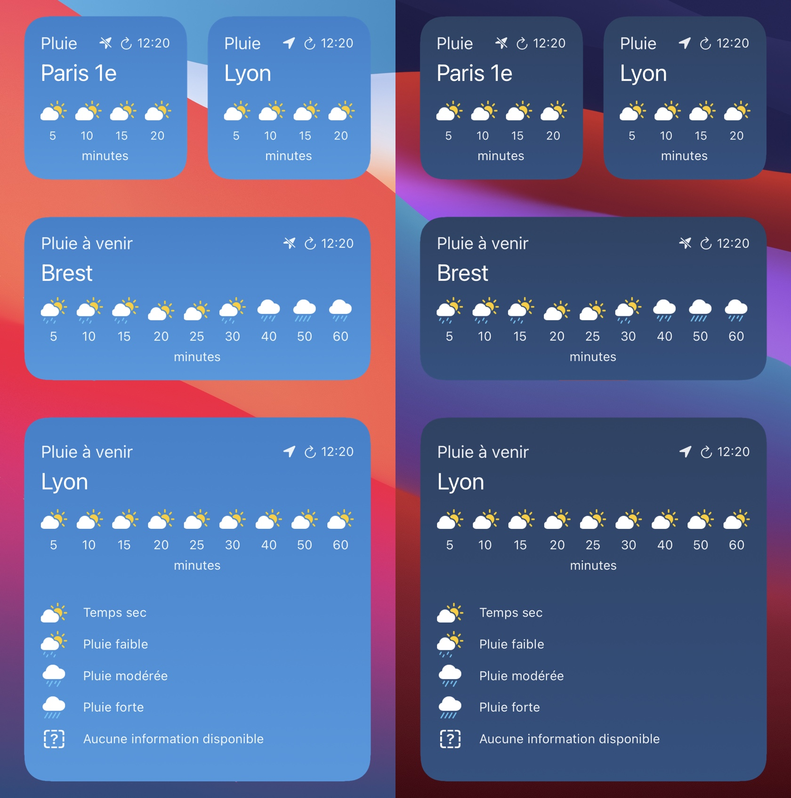

# Rain Forecast Widget

Un widget iOS pour afficher avec précision les prévisions de pluie dans l'heure à venir. Basé sur les données de [Météo France](https://meteofrance.com/). Ne fonctionne qu'en 🇫🇷 France.

# Fonctionnalités

- ☔️ Affichage avec précision des prévisions de pluie pour l'heure à venir
- 📍 Peut exploiter votre position actuelle
- 🏙 Permet de configurer une ville spécifique à afficher
- 📏 Supporte les trois tailles de widget
- 🌓 Affichage adapté au dark mode

   
  

# Installation

- Téléchargez l'app [Scriptable](https://scriptable.app/).
- Créez un nouveau script dans l'app et collez le contenu du fichier [script.js](./script.js).
- Ajoutez un nouveau widget sur l'accueil de votre iPhone et sélectionnez Scriptable.
- Modifiez les paramètres du widget et choisissez le nom du script que vous avez créé.
- Les prévisions de pluie pour votre position actuelle devrait alors s'afficher! 🌈

# Configuration

Vous pouvez choisir d'afficher les prévisions de pluie pour une ville spécifique en modifiant les paramètres du widget et tapant le nom de la ville souhaitée dans le champ `Parameter`:

  

Si vous obtenez une erreur suite au renseignement de la ville, vérifiez [dans la recherche de Météo France](https://meteofrance.com/) (tout en haut) si la ville existe bien.

# Remerciements

- [Simon B. Støvring](https://twitter.com/simonbs) for creating Scriptable
- [Sunrise-Sunset](https://sunrise-sunset.org/api) for their free API
